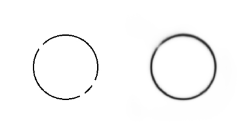
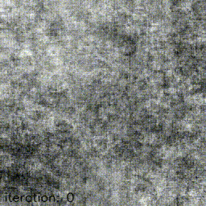

# DeepStructurePriors

The repository is related to the paper 'Contour Completion with Deep Structure Priors'. With no pre-training and no mask (information about which parts of an image are missing) and starting from random noise, our model can complete the missing parts of a 2D shape. Several modules were borrowed from [Deep image prior](https://github.com/DmitryUlyanov/deep-image-prior).

## Requirements
First install requirements:
```
pip install -r requiremetns
```

## Demo
You can run a demo in `demo.ipynb` notebook.




